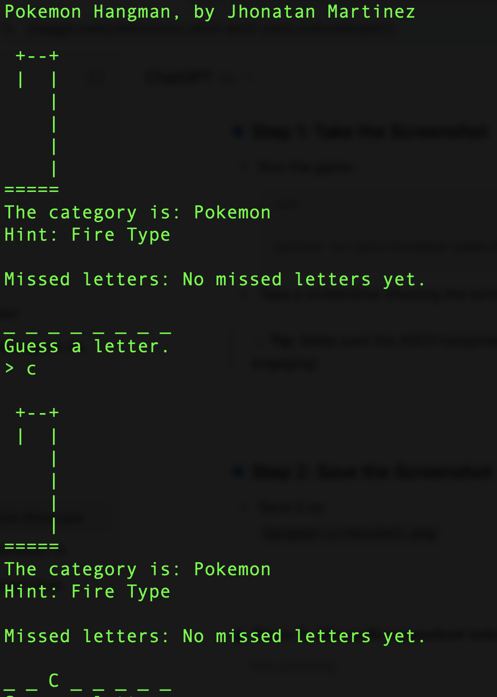
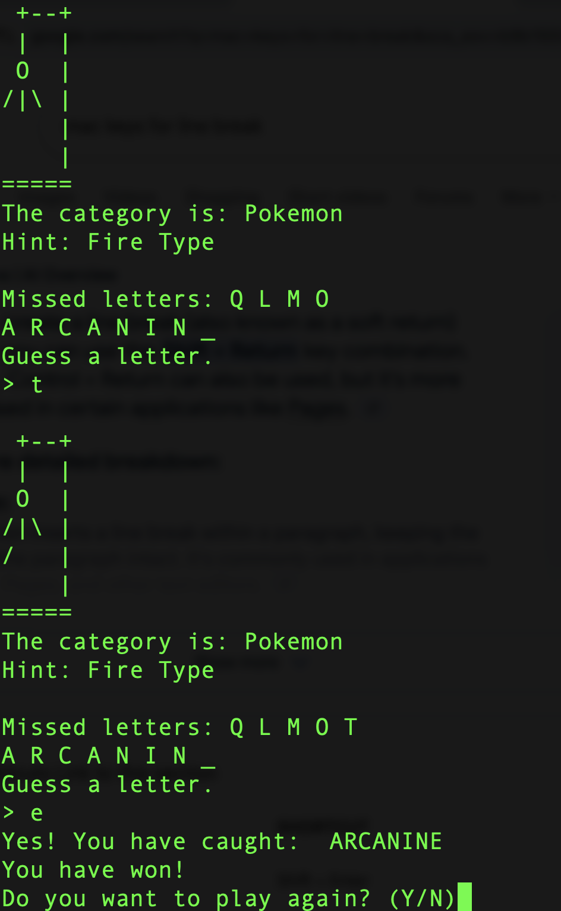

# 🕹️ Pokémon Hangman Game (Python CLI)

A terminal-based Hangman game featuring Pokémon names! This project is written in Python and helps reinforce control flow, string manipulation, user input validation, and ASCII graphics.

---

## 🎮 Gameplay Features

- Random Pokémon name selection across types (Fire, Water, Grass, Electric, Legendary)
- ASCII art hangman graphics
- Category and sub-type hints (e.g., Fire Type)
- Input validation with friendly prompts
- Replay option after each game
- Keyboard interrupt (Ctrl+C) handling for safe exit
## 📸 Screenshot




---

## 🛠️ How to Run

```bash
python hangman.py

